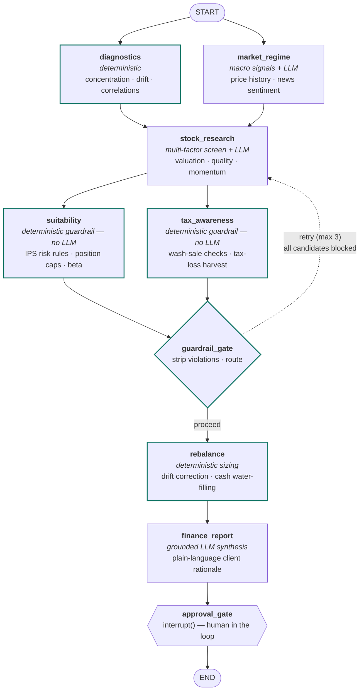

# AI Wealth Manager

[](https://github.com/thompgt/AI_Wealth_Manager/actions/workflows/ci.yml)
[](https://python.org)
[](LICENSE)
[](https://github.com/astral-sh/uv)

An enterprise-grade, multi-tenant portfolio management and multi-agent investment research platform. Specialist agent workflows orchestrate market regime detection, multi-factor security screening, portfolio diagnostics, deterministic suitability checks, tax-lot accounting, automated rebalancing, and compliance-grade client reporting.

Deterministic guardrails with **zero LLM in the control path** enforce hard suitability caps, sector limits, and 30-day wash-sale rules that unconditionally withhold non-compliant recommendations.

---

## Tech Stack


---

## Core Architecture & Key Capabilities

1. **Multi-Tenant by Construction (`security.py`, `db.py`)**
   - Tenancy enforced via scoped SQLAlchemy queries filtering on `org_id` unconditionally. Cross-tenant lookups return HTTP 404 to prevent resource enumeration.
   - Dual-principal authentication: JWT browser sessions (access/refresh with token versions for instant invalidation) and hashed `X-API-Key` machine tokens.
   - Strict RBAC: `viewer` < `advisor` < `compliance` < `admin`. Advisors propose recommendations; compliance officers approve them.

2. **Durable Worker Queue & Heartbeats (`services/jobs.py`, `worker.py`)**
   - Asynchronous execution: `POST /api/v1/clients/{id}/runs` queues an analysis job and returns `202 Accepted` with a job ID and correlation ID.
   - Dedicated background workers claim jobs with database row locking, stream progress, emit periodic heartbeats, and automatically reclaim jobs orphaned by dead workers.

3. **Deterministic Guardrails & Tax-Lot Accounting (`agents/`, `services/tax_lots.py`)**
   - **Zero LLM in the control path:** Model suggestions are strictly screened and sized by deterministic logic against the client's versioned Investment Policy Statement (IPS).
   - Real tax-lot accounting (HIFO, FIFO, LIFO, Specific Lot) tracking short-term and long-term capital gains, cost bases, and active 30-day IRS wash-sale windows.

4. **Field-Level Encryption for PII at Rest (`services/encryption.py`)**
   - Sensitive client PII (`email`, `phone`, `date_of_birth`, `notes`) is encrypted at rest using AES-128-CBC + HMAC-SHA256 (Fernet) with legacy backward compatibility.

5. **Analytical Store & MLflow Observability (`services/mysql_analytics.py`, `services/mlflow_service.py`)**
   - Relational OLTP in PostgreSQL; high-throughput analytical event telemetry and longitudinal portfolio performance stored in a dedicated MySQL analytical schema.
   - MLflow integration tracking prompt versions, token consumption, inference latency, and portfolio financial metrics.

6. **Enterprise Audit Trail & Lifecycle Governance (`services/audit.py`, `server.py`)**
   - Cryptographically hash-chained (`sha256`) audit log guaranteeing non-repudiation and tamper evidence.
   - Full GDPR/CCPA client data export (`GET /api/v1/clients/{id}/export`) and SEC Rule 17a-4 compliant retention-aware data purge (`POST /api/v1/clients/{id}/purge`).
   - Zero-downtime API key rotation with configurable overlapping grace periods.

---

## The LangGraph Multi-Agent Pipeline



---

## Quick Start & Installation

### Option A: Using `uv` (Recommended)

```bash
# Install uv if not already installed
curl -LsSf https://astral.sh/uv/install.sh | sh

# Clone and install dependencies
git clone https://github.com/thompgt/AI_Wealth_Manager.git
cd AI_Wealth_Manager
uv venv
source .venv/bin/activate  # On Windows: .venv\Scripts\activate
uv pip install -e ".[dev]"

# Configure environment
cp .env.example .env
# Edit .env to set your GEMINI_API_KEY and FIELD_ENCRYPTION_KEY
```

### Option B: Using Docker Compose

The complete production topology (API Gateway, Background Worker, PostgreSQL, MySQL Analytics, Prometheus, Grafana) runs out-of-the-box:

```bash
docker compose up -d --build
```

- **API Documentation:** http://localhost:8000/docs
- **Health / Readiness:** http://localhost:8000/ready
- **Prometheus Metrics:** http://localhost:9090
- **Grafana Dashboards:** http://localhost:3000 (admin / admin)

---

## Running the Application Locally

1. **Apply Database Migrations:**
   ```bash
   alembic upgrade head
   ```

2. **Start the API Server:**
   ```bash
   uvicorn server:app --host 0.0.0.0 --port 8000 --reload
   ```

3. **Start the Background Worker:**
   ```bash
   python worker.py
   ```

4. **Launch the Solara Dashboard:**
   ```bash
   solara run app.py --port 8765
   ```

---

## API Usage & Workflow Example

### 1. Authenticate & Obtain JWT Token
```bash
curl -X POST http://localhost:8000/api/v1/auth/login \
  -H "Content-Type: application/json" \
  -d '{"org_slug": "acme-wealth", "email": "advisor@acme.example", "password": "securepassword"}'
```
*Response:*
```json
{
  "access_token": "eyJhbGciOiJIUzI1NiIsIn...",
  "refresh_token": "eyJhbGciOiJIUzI1NiIsIn...",
  "token_type": "bearer",
  "expires_in_minutes": 15
}
```

### 2. Enqueue an Asynchronous Portfolio Analysis Run
```bash
curl -X POST http://localhost:8000/api/v1/clients/1/runs \
  -H "Authorization: Bearer $ACCESS_TOKEN" \
  -H "X-Correlation-ID: req-abc-123"
```
*Response (`202 Accepted`):*
```json
{
  "job_id": 42,
  "status": "queued",
  "correlation_id": "req-abc-123",
  "message": "Analysis run enqueued for background worker processing"
}
```

### 3. Check Job Status & Retrieve Report
```bash
curl -X GET http://localhost:8000/api/v1/jobs/42 \
  -H "Authorization: Bearer $ACCESS_TOKEN"
```

### 4. Rotate an API Key with Zero Downtime
```bash
curl -X POST http://localhost:8000/api/v1/auth/api-keys/5/rotate \
  -H "Authorization: Bearer $ADMIN_TOKEN" \
  -H "Content-Type: application/json" \
  -d '{"grace_period_hours": 24}'
```

---

## Testing, Verification & Quality Gates

The repository enforces strict quality gates across testing, linting, security audits, and migrations:

```bash
# Run the complete test suite with coverage enforcement
pytest --cov=agents --cov=services --cov=server --cov=db --cov-fail-under=65

# Security audit pinned dependencies against known CVEs
pip-audit -r requirements.txt --desc on

# Lint code with Ruff
ruff check .

# Execute load & soak benchmark harness
python scripts/load_harness.py --concurrency 5 --iterations 50
```

---

## Documentation Directory

- **[Production Readiness Workplan](docs/PRODUCTION_READINESS.md):** 19-point audit checklist and implementation status.
- **[Capacity & Sizing Guide](docs/CAPACITY.md):** Benchmarks, throughput profiles, and sizing tiers.
- **[Operations Runbook](docs/RUNBOOK.md):** Deployment, rollback, backup, and incident response playbooks.
- **[Formal Threat Model](docs/THREAT_MODEL.md):** STRIDE analysis, trust boundaries, and security mitigations.
- **[Security Policy](SECURITY.md):** Vulnerability reporting and cryptographic standards.
