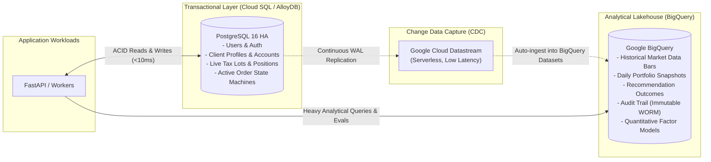
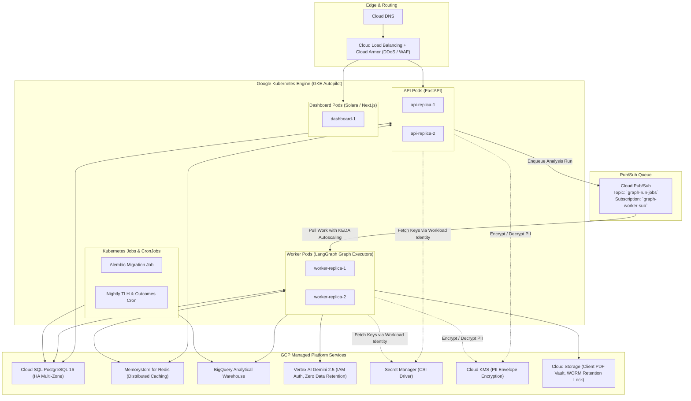

# AI Wealth Manager: GCP & BigQuery Production Architecture & Migration Blueprint

This document details the architectural migration plan for transitioning the **AI Wealth Manager** platform to **Google Cloud Platform (GCP)** and incorporating **BigQuery**.

---

## 1. Database Architecture: BigQuery Strategy & Operational Reality

### A. The OLTP vs. OLAP Boundary
In enterprise financial systems, picking the right database engine for the right access pattern is critical:

* **BigQuery** is an **OLAP (Online Analytical Processing)** columnar warehouse optimized for scanning millions to billions of rows across wide tables in parallel (e.g. running 5-year factor risk models, Brinson attribution regressions across millions of historical tax lots, and calculating portfolio return time series). It charges per byte scanned or per slot-hour.
  * **Critical Trade-Off**: BigQuery has a minimum query latency of ~1–2 seconds, does not support low-latency row locks (`SELECT FOR UPDATE`), enforces strict quotas on streaming partition updates, and lacks foreign-key cascading constraints.
* **PostgreSQL / Cloud SQL / AlloyDB** is an **OLTP (Online Transactional Processing)** relational database optimized for sub-10ms point reads and row-level ACID transactions (e.g. user authentication, concurrent job worker claiming via conditional updates, client profile CRUD, and individual tax-lot accounting).

### B. The Recommended Dual-Engine Architecture (Cloud SQL + BigQuery CDC)



1. **Transactional Core (Cloud SQL / AlloyDB)**:
   - Stores mutable, transactional rows: `organizations`, `users`, `client_profiles`, `accounts`, `positions`, `tax_lots`, `orders`, and `investment_policies`.
2. **Analytical Lakehouse (BigQuery)**:
   - Stores cold, append-only, and analytical data:
     - `market_data_history`: Decades of price history, OHLCV bars, and dividend splits across thousands of assets.
     - `portfolio_snapshots`: Daily point-in-time valuations, cash balances, and external cash flows for calculating True Time-Weighted Returns (TWR) and Money-Weighted Returns (IRR).
     - `recommendation_outcomes`: Forward return evaluation of model picks at 30, 90, and 365 days against benchmark performance.
     - `audit_logs`: Long-term append-only, hash-chained regulatory audit records.
3. **Automated Pipeline via Cloud Datastream**:
   - Uses **Google Cloud Datastream** to capture PostgreSQL Write-Ahead Logs (WAL) and stream changes directly into BigQuery tables with zero custom ETL code.

---

## 2. BigQuery Data Schema (DDL)

Below is the production DDL partitioned and clustered for financial time series analysis and cost efficiency:

```sql
-- Dataset: wealth_manager_analytics
CREATE SCHEMA IF NOT EXISTS `wealth_manager_analytics`
OPTIONS (
  location = 'US',
  description = 'Analytical lakehouse for AI Wealth Manager'
);

-- 1. Historical Market Data (Partitioned by Date, Clustered by Ticker)
CREATE TABLE IF NOT EXISTS `wealth_manager_analytics.market_data_history` (
  ticker STRING NOT NULL,
  as_of_date DATE NOT NULL,
  open_price NUMERIC(18, 6),
  high_price NUMERIC(18, 6),
  low_price NUMERIC(18, 6),
  close_price NUMERIC(18, 6) NOT NULL,
  volume INT64,
  provider STRING NOT NULL,
  fetched_at TIMESTAMP NOT NULL
)
PARTITION BY as_of_date
CLUSTER BY ticker;

-- 2. Portfolio Snapshots (For TWR/IRR & Risk Regressions)
CREATE TABLE IF NOT EXISTS `wealth_manager_analytics.portfolio_snapshots` (
  snapshot_id STRING NOT NULL,
  org_id INT64 NOT NULL,
  client_id INT64 NOT NULL,
  as_of_date DATE NOT NULL,
  market_value NUMERIC(18, 6) NOT NULL,
  cash_balance NUMERIC(18, 6) NOT NULL,
  external_flow_today NUMERIC(18, 6) NOT NULL,
  gross_return_today FLOAT64,
  is_reconstructed BOOL NOT NULL,
  captured_at TIMESTAMP NOT NULL
)
PARTITION BY as_of_date
CLUSTER BY org_id, client_id;

-- 3. Recommendation Outcomes (For Strategy Scorecards & Evals)
CREATE TABLE IF NOT EXISTS `wealth_manager_analytics.recommendation_outcomes` (
  outcome_id STRING NOT NULL,
  org_id INT64 NOT NULL,
  client_id INT64 NOT NULL,
  run_id STRING NOT NULL,
  ticker STRING NOT NULL,
  recommended_at TIMESTAMP NOT NULL,
  horizon_days INT64 NOT NULL,
  eval_due_date DATE NOT NULL,
  base_price NUMERIC(18, 6) NOT NULL,
  horizon_price NUMERIC(18, 6),
  asset_return FLOAT64,
  benchmark_return FLOAT64,
  excess_return FLOAT64,
  hit BOOL,
  evaluated_at TIMESTAMP
)
PARTITION BY eval_due_date
CLUSTER BY ticker, horizon_days;

-- 4. Regulatory Audit Log (Immutable WORM Record)
CREATE TABLE IF NOT EXISTS `wealth_manager_analytics.audit_logs` (
  event_id STRING NOT NULL,
  org_id INT64 NOT NULL,
  user_id INT64,
  action STRING NOT NULL,
  entity_type STRING NOT NULL,
  entity_id STRING NOT NULL,
  occurred_at TIMESTAMP NOT NULL,
  detail_json JSON,
  previous_hash STRING,
  current_hash STRING NOT NULL
)
PARTITION BY DATE(occurred_at)
CLUSTER BY org_id, action;
```

---

## 3. GCP Deployment Architecture

The production architecture deploys to **Google Kubernetes Engine (GKE Autopilot)** or **Cloud Run** backed by managed Google Cloud services.



### Key Components

1. **GKE Autopilot Compute Layer**:
   - **API Deployment**: Stateless FastAPI pods serving HTTP requests. Auto-scales horizontally based on concurrent HTTP requests and CPU utilization.
   - **Worker Deployment**: Dedicated pods executing LangGraph agent workflows (`orchestrator.py`). Auto-scales using **KEDA (Kubernetes Event-driven Autoscaling)** based on the queue depth of Cloud Pub/Sub.
   - **Workload Identity**: No GCP service account keys in environment variables or container images. Kubernetes Service Accounts bind directly to GCP IAM roles.

2. **Asynchronous Messaging via Cloud Pub/Sub**:
   - Replaces the current PostgreSQL row-polling mechanism (`services/jobs.py`).
   - `POST /api/v1/clients/{id}/runs` publishes a JSON envelope to `graph-run-jobs`.
   - Workers acknowledge messages upon completion or checkpointing. Unhandled crashes route to a **Dead Letter Topic (DLT)** with Cloud Alerting.

3. **Vertex AI Gemini Integration**:
   - Upgrades `services/llm.py` from consumer `ChatGoogleGenerativeAI` with static API keys to **`ChatVertexAI`** via `langchain-google-vertexai`.
   - **Enterprise Security**: Enterprise SLA, SOC-2 / HIPAA compliance, and guaranteed non-retention of client portfolio data for foundation model training.

4. **Cloud KMS Field-Level Encryption (PII Protection)**:
   - Implements envelope encryption for client sensitive data (SSN, date of birth, net worth):
     - Local 256-bit Data Encryption Key (DEK) encrypts individual database columns.
     - Key Encryption Key (KEK) is managed by Google Cloud KMS with automated key rotation.

---

## 4. Kubernetes Manifests (GKE Deployment Draft)

### A. API Deployment & Service
```yaml
apiVersion: apps/v1
kind: Deployment
metadata:
  name: wealth-manager-api
  namespace: wealth
  labels:
    app.kubernetes.io/name: api
spec:
  replicas: 2
  selector:
    matchLabels:
      app.kubernetes.io/name: api
  template:
    metadata:
      labels:
        app.kubernetes.io/name: api
    spec:
      serviceAccountName: k8s-wealth-service-account
      containers:
        - name: api
          image: us-docker.pkg.dev/PROJECT_ID/wealth-repo/ai-wealth-manager:latest
          command: ["uvicorn", "server:app", "--host", "0.0.0.0", "--port", "8000"]
          ports:
            - containerPort: 8000
          env:
            - name: ENVIRONMENT
              value: "production"
            - name: LOG_FORMAT
              value: "json"
            - name: JOB_WORKER_ENABLED
              value: "false"
            - name: NEON_DATABASE_URL
              valueFrom:
                secretKeyRef:
                  name: db-credentials
                  key: database-url
          resources:
            requests:
              cpu: "500m"
              memory: "1Gi"
            limits:
              cpu: "2"
              memory: "4Gi"
          readinessProbe:
            httpGet:
              path: /ready
              port: 8000
            initialDelaySeconds: 10
            periodSeconds: 10
          livenessProbe:
            httpGet:
              path: /health
              port: 8000
            initialDelaySeconds: 15
            periodSeconds: 20
---
apiVersion: v1
kind: Service
metadata:
  name: wealth-manager-api
  namespace: wealth
spec:
  type: ClusterIP
  selector:
    app.kubernetes.io/name: api
  ports:
    - port: 8000
      targetPort: 8000
```

### B. Worker Deployment with KEDA Autoscaling
```yaml
apiVersion: apps/v1
kind: Deployment
metadata:
  name: wealth-manager-worker
  namespace: wealth
  labels:
    app.kubernetes.io/name: worker
spec:
  replicas: 2
  selector:
    matchLabels:
      app.kubernetes.io/name: worker
  template:
    metadata:
      labels:
        app.kubernetes.io/name: worker
    spec:
      serviceAccountName: k8s-wealth-service-account
      terminationGracePeriodSeconds: 60
      containers:
        - name: worker
          image: us-docker.pkg.dev/PROJECT_ID/wealth-repo/ai-wealth-manager:latest
          command: ["python", "worker.py"]
          env:
            - name: ENVIRONMENT
              value: "production"
            - name: LOG_FORMAT
              value: "json"
            - name: JOB_WORKER_ENABLED
              value: "true"
            - name: NEON_DATABASE_URL
              valueFrom:
                secretKeyRef:
                  name: db-credentials
                  key: database-url
          resources:
            requests:
              cpu: "1"
              memory: "2Gi"
            limits:
              cpu: "4"
              memory: "8Gi"
---
# KEDA ScaledObject: Scale Workers on Pub/Sub Backlog
apiVersion: keda.sh/v1alpha1
kind: ScaledObject
metadata:
  name: pubsub-worker-scaler
  namespace: wealth
spec:
  scaleTargetRef:
    name: wealth-manager-worker
  minReplicaCount: 1
  maxReplicaCount: 10
  triggers:
    - type: gcp-pubsub
      metadata:
        subscriptionName: "graph-worker-sub"
        mode: "SubscriptionSize"
        value: "5"
```

---

## 5. Terraform Infrastructure as Code (IaC) Draft

Below is the root Terraform configuration for standing up the foundational GCP components:

```hcl
terraform {
  required_version = ">= 1.5.0"
  required_providers {
    google = {
      source  = "hashicorp/google"
      version = "~> 5.0"
    }
  }
}

variable "project_id" {
  description = "GCP Project ID"
  type        = string
}

variable "region" {
  description = "Default GCP Region"
  type        = string
  default     = "us-central1"
}

provider "google" {
  project = var.project_id
  region  = var.region
}

# 1. VPC & Private Network
resource "google_compute_network" "vpc" {
  name                    = "wealth-vpc"
  auto_create_subnetworks = false
}

resource "google_compute_subnetwork" "subnet" {
  name                     = "wealth-subnet"
  ip_cidr_range            = "10.0.0.0/20"
  region                   = var.region
  network                  = google_compute_network.vpc.id
  private_ip_google_access = true
}

# 2. Cloud SQL PostgreSQL (HA Multi-Zone)
resource "google_sql_database_instance" "postgres" {
  name             = "wealth-postgres-instance"
  database_version = "POSTGRES_16"
  region           = var.region

  settings {
    tier              = "db-custom-4-16384"
    availability_type = "REGIONAL"
    disk_size         = 100
    disk_type         = "PD_SSD"

    backup_configuration {
      enabled                        = true
      point_in_time_recovery_enabled = true
    }

    ip_configuration {
      ipv4_enabled    = false
      private_network = google_compute_network.vpc.id
    }

    database_flags {
      name  = "statement_timeout"
      value = "30000"
    }
    database_flags {
      name  = "lock_timeout"
      value = "10000"
    }
  }
}

# 3. BigQuery Analytics Dataset
resource "google_bigquery_dataset" "analytics" {
  dataset_id                  = "wealth_manager_analytics"
  friendly_name               = "Wealth Manager Analytics Lakehouse"
  location                    = "US"
  default_table_expiration_ms = null
}

# 4. Pub/Sub Topic and Subscription for Job Distribution
resource "google_pubsub_topic" "jobs_topic" {
  name = "graph-run-jobs"
}

resource "google_pubsub_subscription" "jobs_sub" {
  name  = "graph-worker-sub"
  topic = google_pubsub_topic.jobs_topic.name

  ack_deadline_seconds       = 300
  retain_acked_messages      = false
  message_retention_duration = "86400s"

  dead_letter_policy {
    dead_letter_topic     = google_pubsub_topic.jobs_dlq.id
    max_delivery_attempts = 3
  }
}

resource "google_pubsub_topic" "jobs_dlq" {
  name = "graph-run-jobs-dlq"
}

# 5. Cloud Storage Vault with WORM Retention
resource "google_storage_bucket" "reports_vault" {
  name          = "${var.project_id}-wealth-reports-vault"
  location      = "US"
  force_destroy = false

  retention_policy {
    is_locked        = true
    retention_period = 220752000 # 7 years in seconds (SEC Rule 17a-4)
  }
}

# 6. GKE Autopilot Cluster
resource "google_container_cluster" "autopilot" {
  name     = "wealth-gke-autopilot"
  location = var.region
  network  = google_compute_network.vpc.name
  subnetwork = google_compute_subnetwork.subnet.name

  enable_autopilot = true

  ip_allocation_policy {}
}
```

---

## 6. Phased Migration Checklist

1. **Phase 1: Dual-Storage Ingestion (Postgres -> BigQuery)**
   - Spin up BigQuery dataset and deploy the partitioning DDL.
   - Implement continuous streaming ingestion from `portfolio_snapshots` and `recommendation_outcomes` into BigQuery via Google Cloud Datastream.
2. **Phase 2: Transition to Vertex AI & Cloud Pub/Sub**
   - Switch `services/llm.py` to `langchain-google-vertexai`.
   - Update `services/jobs.py` to dispatch to Google Cloud Pub/Sub while preserving the worker state machine.
3. **Phase 3: Container Deployment to GKE Autopilot**
   - Build container images via Cloud Build and push to Artifact Registry (`us-docker.pkg.dev`).
   - Deploy Kubernetes manifests with Workload Identity and KEDA autoscaling.
4. **Phase 4: Cutover & Hardening**
   - Enable Cloud Armor security policies on the Load Balancer.
   - Lock down Cloud Storage buckets with 7-year WORM retention policies for SEC regulatory compliance.
